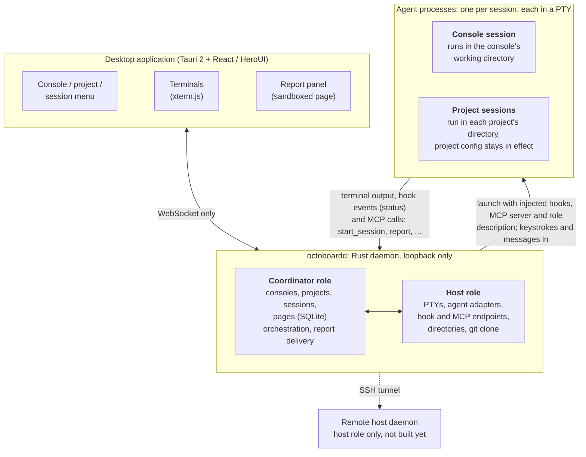

# Octoboard

  

**The Programming Terminator**

Octoboard is a local, open source command center for coding agents. A coordinating agent organizes work across
projects, while each project runs its own native agent session with its own instructions, tools, and context.
Follow the whole product from one place, or open any project conversation and work with its agent directly.

The slogan pairs the ambition to take programming work off your hands with the image of a powerful Terminator in
the programming world.

> **Status: early development.** The core features are built on macOS with Apple Silicon: consoles, projects,
> native agent sessions in real terminals, task dispatch and reporting, and the report panel. Installers are
> coming soon on GitHub Releases.

[Download Octoboard](https://github.com/baijunjie/octoboard/releases) · [How it works](#how-it-works) ·
[MIT License](LICENSE)

## Your product spans repositories

A feature rarely stops at one repository. Adding team invitations might require a new frontend flow, backend API
changes, and updated documentation. Each project has its own conventions, history, and tools, sometimes maintained
with a different brand of coding agent.

A session started in one project does not necessarily discover another project's instructions or Skills when it
works across repositories. What a delegated subagent inherits also depends on the agent and its configuration.
Coordinating that work can mean repeatedly finding, copying, and explaining the context each project needs.

Octoboard gives each project a session launched in its own directory. The agent uses its normal mechanisms for
loading project instructions, Skills, hooks, tools, and permissions. A separate coordinating session connects the
work across those project sessions.

## What stays with each project

- **Its own working context.** Dedicated sessions keep project rules and conversations close to the code. Existing
  instruction files and agent tools continue to work through that agent's native discovery mechanisms.
- **Its choice of agent.** Use Claude Code, Codex, or Grok Build across the same product. Choose the coordinator and
  project agents independently, keeping the agent and toolchain that fit each project. Planning, implementation,
  documentation, and other tasks can be assigned according to the agents and tools you have configured.
- **A direct line to you.** Watch the terminal, add background, change direction, or work alongside a project agent.
  Delegating coordination does not take you out of the conversation.

## What the coordinator brings together

A **console** groups the projects that belong together. It can run several **console sessions** at once, each a
coordinating agent with its own tasks, project sessions, and reports. Give one a product goal, and it identifies
the projects involved, starts focused sessions, follows up on their work, and summarizes the results.

The project sessions it starts report completed work, remaining tasks, and decisions they need back to that console
session. The coordinator can use those reports to sequence dependencies, pass relevant context between
projects, and keep the work aligned. You can follow progress in the terminals and view the summaries or other pages
it creates in the report panel. Beyond prose, the coordinator can present tables, compare approaches, or offer a
form for your decisions. Submitting a form sends your answers back to that coordinating session, and earlier pages
remain available in its report history.

An ongoing console conversation can build on the product background, project knowledge, and reports available to
it. That gives the coordinator a clearer picture of how the engineering work fits together, reducing repeated
explanations as you continue working. Its understanding comes from that available context.

## A project can have its own agent team

A project session you open without assigning it to a console coordinator can also organize work inside that
project. It can start and manage other native sessions there, choosing any supported agent for each task. Those
sessions report back to the project session that started them, with the same native project configuration in effect.

Sessions in the same project can share findings and context, such as an implementation decision or a test result.
When the receiving session has a coordinator, that coordinator receives a copy too. Sharing information does not
transfer control of the task: each session continues to take instructions from its own coordinator or from you.
Work across different projects is coordinated through the console sessions.

## How it works

1. **Give the coordinator a goal.** Create a console, associate the relevant projects, and describe the outcome,
   constraints, and product background in its console session.
2. **Let each project handle its part.** The coordinator launches dedicated project sessions with focused briefs.
   Each agent works in its own project directory and reports progress, results, or questions back.
3. **Review and steer the work.** Continue through the coordinator or enter any project conversation directly.
   Clarify requirements, resolve decisions, and check the result while the coordinator follows the broader task.

For example, a request to add team invitations can become separate frontend, backend, and documentation tasks.
The backend session reports the API contract; the coordinator passes that information to the frontend session and
uses the resulting reports to follow integration and documentation work. Each project keeps its own agent and
working context throughout.

## Get started

Installers for **macOS on Apple Silicon** are coming soon on
[GitHub Releases](https://github.com/baijunjie/octoboard/releases).

| Platform | Status |
|---|---|
| macOS (Apple Silicon) | Developed; installer coming soon |
| Linux | Planned |
| Windows | Planned |
| iOS | Planned |
| Android | Planned |

For local development, the [desktop development guide](apps/desktop/README.md#development) covers the workspace,
Rust build requirements, daemon sidecar, and application commands.

Install and authenticate the agent CLIs you want to use with their own providers first. Octoboard launches those
installed agents using your shell environment; it does not supply their accounts or subscriptions. See
[Launching agents](docs/product/launching-agents.md) for configuration and provider-specific behavior.

Octoboard is free and open source under the MIT License. Whether an agent or model service costs money depends on
your chosen account and plan; any charges come directly from that provider. Octoboard does not add fees.

## Local execution and data

The application and its daemon run on your machine. Octoboard stores its own application data locally and does not
upload your code or conversations to servers operated by its developer.

Your configured agents and tools can send prompts, code, and context to their service providers. Task briefs and
reports passed between sessions may consequently be processed by more than one provider when different agents
collaborate. Git operations, including cloning and checking remote status, can also connect to your configured
repository remotes.

**Remote host support is planned and is not available yet.** The intended workflow is to coordinate from your
computer while projects and their agents run on a host you choose. Connection and data handling details will be
documented before that feature is released.

## This is an AI-native project

Every line of code in this repository is written by AI. Humans set the direction, review the result, and decide what
gets built — they do not hand-write the code.

Because of that, the contribution model is unusual:

- **Pull requests are not accepted.** Any PR will be closed without review.
- **[Open an issue](https://github.com/baijunjie/octoboard/issues) instead.** Describe the bug, the missing
  capability, or the idea. Once an issue is accepted, an AI agent is assigned to implement it.

## Architecture

The desktop application is a Tauri 2 shell around a React and HeroUI interface. A separate Rust daemon,
`octoboardd`, owns agent processes and Octoboard's application data. The UI communicates with the daemon through
its WebSocket/HTTP protocol; daemon traffic and session state do not pass through Tauri IPC.

- **Native processes and terminals.** Each session runs an installed agent CLI in a PTY, rendered with xterm.js.
  The current daemon listens only on loopback.
- **Coordination through the daemon.** Console sessions coordinate across projects. Unbound project sessions can
  manage sessions within their own project, and sessions bound to a coordinator report back to it. Every project
  session can discover its project's other running sessions and share information with them. Instructions,
  shared information, and reports all pass through the daemon.
- **Configuration per launch.** Octoboard injects its status hooks, MCP server, and role description when starting
  an agent. It does not install its configuration files into project directories; the agent's own configuration
  continues to apply.

For the full design, see [Architecture](docs/architecture.md). The [project map](docs/project-map.md) points to the
modules and their development guides; the [documentation index](docs/README.md) covers product behavior and
engineering details.

## License

[MIT](LICENSE)
