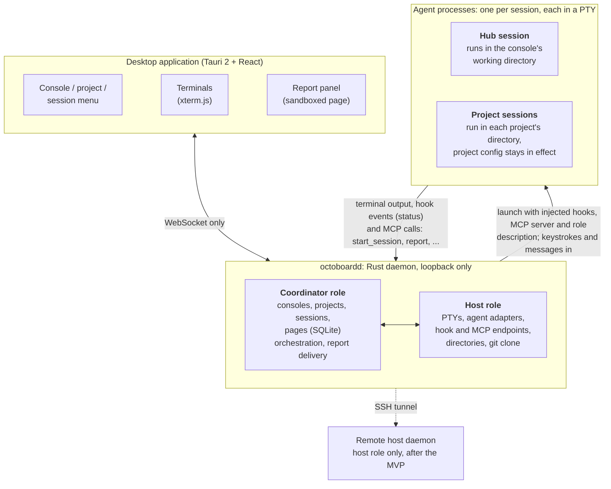

# Octoboard

A desktop control board for orchestrating coding agents across multiple projects.

> **Status: early development.** The MVP's features are built — consoles, projects, sessions in real terminals, a hub
> agent dispatching work across projects and reporting back, and the report panel — on macOS (Apple Silicon). A final
> round of checks on a real build is still outstanding, and no release is published yet, so for now Octoboard is built
> from source.

## This is an AI-native project

Every line of code in this repository is written by AI. Humans set the direction, review the result, and decide what
gets built — they do not hand-write the code.

Because of that, the contribution model is unusual:

- **Pull requests are not accepted.** Any PR will be closed without review.
- **[Open an issue](https://github.com/baijunjie/octoboard/issues) instead.** Describe the bug, the missing
  capability, or the idea. Once an issue is accepted, an AI agent is assigned to implement it.

## What it is

In Octoboard, a **console** groups a set of projects and has its own **hub agent**. You hand a request to the hub
agent, and it decides which project the task belongs to, starts a dedicated agent session in that project's
directory, and hands the task over. When the session finishes it reports back to the hub, and the hub reports to you.
You can switch to any session at any moment to watch it or take over by typing into its terminal directly.

Octoboard is neither a new agent nor a new terminal. Every session is a native agent CLI process — Claude Code,
Codex, Grok Build — running in the project directory so that the project's own configuration (`CLAUDE.md` /
`AGENTS.md`, skills, hooks, permissions) stays in effect. Octoboard only adds a layer of organization, orchestration,
and observation on top, and is not tied to any agent vendor.

## Architecture

Octoboard is a desktop application on top of a headless daemon. The application only renders and forwards input; the
daemon owns every agent process and all of Octoboard's own data. The two talk over a WebSocket/HTTP protocol and nothing else — no
shared state, no Tauri IPC — which is what lets a remote host slot in later without a redesign.

- **Desktop application** — also raises the notification when a session is waiting for the user.
- **Coordinator and host** — the host role receives each agent's hook events and MCP tool calls; the coordinator
  executes them, and delivers project sessions' reports to the hub, synthesising one when a session stops without
  reporting.
- **Injection** — Octoboard's hooks, MCP server and role description are added per launch; project files and the
  user's agent configuration are never modified. The one thing it does for the user is answer Claude Code's own
  first-launch trust prompt — for a project session only after the user has agreed; a hub's own console directory
  needs no consent.
- **Agent sessions** — the hub has the orchestration tools, a project session has one tool, `report`, and the two
  never talk to each other directly: everything between them passes through the daemon.

For the design in full, see [`docs/mvp.md`](docs/mvp.md) and the product docs indexed in
[`docs/README.md`](docs/README.md).

## License

[MIT](LICENSE)
