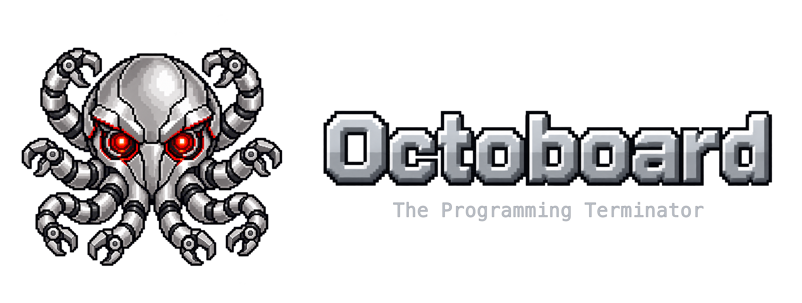

# Octoboard

  

Octoboard is a local, open source command center for coding agents.

Octoboard is for large projects inside a company. One product is split across repositories, each
with its own rules and often its own agent. A change rarely stays in one of them. One agent session
can miss another project's instructions and tools, so you end up copying context and relaying results.

Octoboard starts a native session in each project directory, so that project keeps its own agent,
instructions, and tools. A coordinating agent splits the work, hands each project its part, and brings the
reports back together. You can still open any project conversation and work with its agent directly.

The full introduction is on [octoboard.dev](https://octoboard.dev).

**Status: early development.** The macOS app for Apple Silicon is developed. An installer is coming soon on
[GitHub Releases](https://github.com/baijunjie/octoboard/releases).

| Platform | Status |
|---|---|
| macOS (Apple Silicon) | Developed; installer coming soon |
| Linux | Planned |
| Windows | Planned |
| iOS | Planned |
| Android | Planned |

## Develop

Install the agent CLIs you want to use. Octoboard launches them from your shell environment. Those agents are
yours, including one you point at a model you host yourself. How a launch is configured is in
[Launching agents](docs/product/launching-agents.md).

Build and run the desktop app from the
[desktop development guide](apps/desktop/README.md#development): install the workspace, build the daemon sidecar,
then start Tauri.

The desktop shell is [Tauri 2](https://github.com/tauri-apps/tauri) around a
[React](https://github.com/facebook/react) and [HeroUI](https://github.com/heroui-inc/heroui) interface. A
[Rust](https://github.com/rust-lang/rust) daemon, `octoboardd`, owns agent processes and application data.
Terminals render with [xterm.js](https://github.com/xtermjs/xterm.js). The UI talks to the daemon over
WebSocket/HTTP only. Where to read next: [project map](docs/project-map.md),
[architecture](docs/architecture.md), [documentation index](docs/README.md).

## This is an AI-native project

Every line of code in this repository is written by AI. Humans set the direction, review the result, and decide
what gets built — they do not hand-write the code.

- **Pull requests are not accepted.** Any PR will be closed without review.
- **[Open an issue](https://github.com/baijunjie/octoboard/issues) instead.** Describe the bug, the missing
  capability, or the idea. Once an issue is accepted, an AI agent is assigned to implement it.

## License

[MIT](LICENSE)
